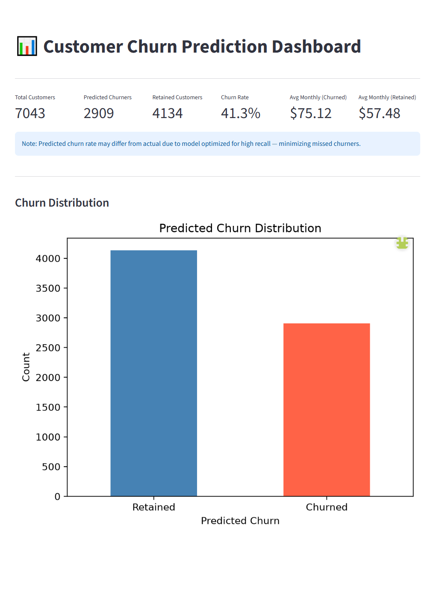
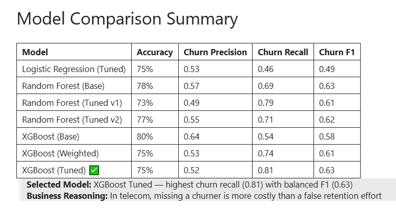
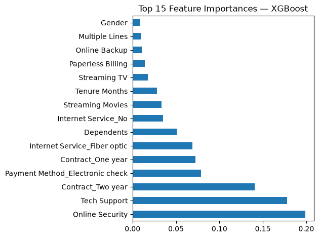

# 📊 Telecom Customer Churn Prediction Platform

An end-to-end Data Science project covering data cleaning, exploratory data analysis, machine learning modeling, automated reporting, and an interactive Streamlit dashboard — built using the IBM Telco Customer Churn dataset.

🚀 **Live Dashboard:** [churn-prediction-zainali.streamlit.app](https://churn-prediction-zainali.streamlit.app)

---

## 📸 Screenshots

### Dashboard Overview


### Churn Predictions


### Model Comparison


### Feature Importance


---

## 🎯 Project Goal

Build a complete customer analytics platform that identifies customers at risk of churning, generates automated business reports, and presents insights through an interactive dashboard — targeting roles in data science and analytics.

---

## 🛠️ Tech Stack

| Area | Tool |
|---|---|
| Language | Python 3.11 |
| ML Models | Scikit-learn, XGBoost |
| Data Processing | Pandas, NumPy |
| Visualization | Matplotlib, Seaborn |
| Dashboard | Streamlit |
| Notebook | Jupyter |
| Version Control | Git, GitHub |

---

## 📁 Project Structure

```
telecom-churn-prediction/
├── data/
│   ├── raw/                        # Original dataset
│   └── processed/                  # Cleaned dataset
├── notebooks/
│   ├── 01_EDA_and_Cleaning.ipynb   # Exploratory Data Analysis & Cleaning
│   └── 02_modeling.ipynb           # ML Model Building & Evaluation
├── src/
│   ├── data_processing.py          # Preprocessing pipeline
│   ├── model.py                    # Model training & evaluation
│   └── reporting.py                # Automated report generation
├── dashboard/
│   └── app.py                      # Streamlit dashboard
├── models/                         # Saved model files
├── reports/                        # Generated reports & visualizations
├── requirements.txt
└── README.md
```

---

## 🔍 Key EDA Findings

- **Contract Type** — Month-to-month customers churn at the highest rate, long-term contracts rarely churn
- **Internet Service** — Fiber optic customers churn the most due to higher monthly charges
- **Online Security & Tech Support** — Customers without these services churn at ~41% vs ~15% for those with them
- **Payment Method** — Electronic check users have the highest churn rate
- **Demographics** — Gender has no impact; senior citizens churn at nearly double the rate of non-seniors
- **Tenure** — Newer customers are significantly more likely to churn

---

## 🤖 Model Results

| Model | Accuracy | Churn Precision | Churn Recall | Churn F1 |
|---|---|---|---|---|
| Logistic Regression (Tuned) | 75% | 0.53 | 0.46 | 0.49 |
| Random Forest (Base) | 78% | 0.57 | 0.69 | 0.63 |
| Random Forest (Tuned v1) | 73% | 0.49 | 0.79 | 0.61 |
| Random Forest (Tuned v2) | 77% | 0.55 | 0.71 | 0.62 |
| XGBoost (Base) | 80% | 0.64 | 0.54 | 0.58 |
| XGBoost (Weighted) | 75% | 0.53 | 0.74 | 0.61 |
| **XGBoost (Tuned) ✅** | **75%** | **0.52** | **0.81** | **0.63** |

**Selected Model:** XGBoost Tuned — highest churn recall (0.81) with balanced F1 (0.63)

**Business Reasoning:** In telecom, missing a churner (lost revenue) is more costly than a false alarm (wasted retention effort) — high recall is prioritized.

---

## 📊 Dashboard Features

- **Overview** — KPIs including total customers, predicted churners, churn rate, and average monthly charges
- **EDA Insights** — Interactive charts showing churn patterns across contract type, internet service, tenure, and monthly charges
- **Churn Predictions** — High risk customer table with churn probability scores
- **Upload & Predict** — Upload new customer data for instant churn predictions
- **Download Reports** — Export churned customers, high risk customers, and summary reports as CSV

---

## ⚙️ How to Run Locally

**1. Clone the repository**
```bash
git clone https://github.com/ZainAli-2001/telecom-churn-prediction.git
cd telecom-churn-prediction
```

**2. Create and activate virtual environment**
```bash
python -m venv myvenv
myvenv\Scripts\activate  # Windows
```

**3. Install dependencies**
```bash
pip install -r requirements.txt
```

**4. Add dataset**

Download the IBM Telco Customer Churn dataset from [Kaggle](https://www.kaggle.com/datasets/blastchar/telco-customer-churn) and place it in `data/raw/`.

**5. Train the model**
```bash
cd src
python model.py
```

**6. Run the dashboard**
```bash
streamlit run dashboard/app.py
```

---

## 📂 Dataset

- **Name:** IBM Telco Customer Churn
- **Source:** [Kaggle](https://www.kaggle.com/datasets/blastchar/telco-customer-churn)
- **Size:** 7,043 customers, 33 features
- **Target:** Churn Value (0 = Retained, 1 = Churned)

---

## 👤 Author

[Zain Ali](https://github.com/ZainAli-2001)
